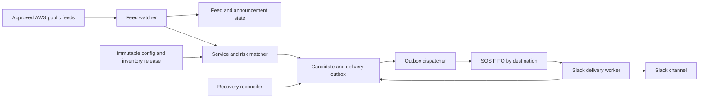

# AWS Public Change Alerting

[](#validation-status)
[](https://github.com/lilabrooks/aws-public-change-feed/actions/workflows/quality.yml)
[](https://github.com/lilabrooks/aws-public-change-feed/actions/workflows/reference-links.yml)
[](#local-validation)
[](LICENSE)

[](schemas/)
[](docs/architecture/README.md)
[](AGENTS.md)

AWS Public Change Alerting turns public AWS announcements into route-scoped review work for teams that operate repeated AWS stacks. It fetches approved AWS feeds, matches announcements against declared services and risk rules, maps matches to potentially relevant environments, and delivers the resulting feed through Slack.

Slack is a delivery channel. The service's product is the filtered, explainable public-change feed and its durable candidate history.

## Why it exists

AWS publishes changes across What's New, blogs, and security bulletins. A general feed reader can collect those posts, but it does not know which services each environment uses, why a phrase is risky, or which team should review it. This project adds that missing context without requiring access to customer AWS accounts.

Each alert answers:

- What did AWS publish, and where is the source?
- Which configured service and risk rule matched?
- Which environment profiles make the item potentially relevant?
- Which Slack destination owns the review?
- Which exact configuration, inventory, and application version produced the result?

The service infers relevance from configuration. It does not claim that an account or resource is affected. Confirmed impact belongs in the operator's existing account-specific tools.

## Product boundary

Included:

- Safe RSS and Atom acquisition from approved public AWS hosts.
- Canonical announcement identity, revision tracking, and merged feed provenance.
- Deterministic service and risk matching.
- Static environment, profile, customer, and Slack-route mapping.
- Versioned `AlertCandidate` and `DeliveryRequest` contracts.
- A durable DynamoDB outbox, destination-grouped SQS FIFO transport, retry control, dedupe, and recovery.
- Slack incoming-webhook or bot-token delivery.
- Immutable configuration releases, alarms, replay evidence, and production preflight checks.

Excluded:

- Customer-account API access or cross-account roles.
- Account-specific event, security-finding, spend, or resource telemetry.
- Incident management, remediation, ticketing, acknowledgement workflows, or external platform adapters.
- A promise of exactly-once Slack posting.

[ADR-017](docs/adr/017-public-feed-only-product-scope.md) records this boundary.

## Processing flow



The watcher persists every candidate and delivery record before advancing a feed checkpoint. DynamoDB is the delivery system of record. SQS transports ready work and orders it per Slack destination. Unknown HTTP outcomes stop for operator review.

## Repository status

This repository currently contains a contract-validated architecture package: numbered specifications, accepted ADRs, machine-readable contracts, canonical examples, semantic validators, and regression tests. The Terraform roots and Python runtime named by the design remain implementation milestones. Do not describe the repository as deployable until those artifacts and production acceptance tests exist.

## Validation status

The `contracts validated` badge means the repository artifacts pass automated contract checks. [`make check`](Makefile) and the [Repository quality workflow](.github/workflows/quality.yml) provide the evidence:

- Each of the six canonical examples passes its paired JSON Schema.
- The complete example bundle passes cross-document checks for projections, references, routes, release hashes, deterministic identities, retention, and byte limits.
- Regression tests mutate valid fixtures and confirm that rejected configuration and event-contract changes fail validation.
- Python formatting, lint, typing, YAML, local links, reference dates, and Git whitespace pass the repository quality gate.

The [Reference links workflow](.github/workflows/reference-links.yml) checks external sources separately. The specifications and accepted ADRs define the planned system behavior and remain subject to document review. Runtime execution, Terraform deployment, live feed acquisition, Slack delivery, and production acceptance evidence are future implementation milestones recorded in the [goal](docs/GOAL.md).

## Start here

1. Read [the goal](docs/GOAL.md) for scope, outcomes, and the build sequence.
2. Read [the architecture index](docs/architecture/README.md) for document ownership and folder structure.
3. Read [the overview](docs/architecture/specification/01-overview.md), then continue through the numbered specification.
4. Review [the accepted decisions](docs/architecture/README.md#architecture-decision-records).
5. Inspect the executable contract bundle in [`examples/`](examples/) and its paired contracts in [`schemas/`](schemas/).

## Local validation

Python 3.12 or newer is required.

```bash
python3.12 -m venv .venv
. .venv/bin/activate
make install
make check
```

Run the network-backed reference check separately:

```bash
make references-online
```

The local validation covers JSON Schema, cross-document semantics, deterministic identities, rejected configuration mutations, local links, reference review dates, Python formatting, lint, type checking, YAML, and Git whitespace.

## Executable contract examples

The six files in [`examples/`](examples/) form one canonical, mutually valid contract bundle. Repository validation and tests consume these fixtures directly. Production deployments supply separate reviewed values.

Together, the examples trace one complete contract path from deployment and matching inputs through an immutable release to a route-scoped candidate and its Slack delivery request:

- `examples/deployment.yaml` holds infrastructure-coupled settings, destinations, environment inventory inputs, retention, fetch limits, and the supported scale declaration.
- `examples/config.yaml` holds feeds, service definitions, profiles, environment policy, risk rules, and message limits.
- `examples/inventory.json` is the runtime projection of deployed environments and Slack routes.
- `examples/active-versions.json` binds exact configuration and inventory object versions into one immutable release.
- `examples/alert-candidate.json` and `examples/delivery-request.json` show the feed and delivery boundaries.

`make check` validates each file against its paired JSON Schema, then checks the bundle's cross-document rules. Those checks cover projections, references, release hashes, deterministic identities, route mapping, retention, and byte limits. Regression tests mutate copies of the examples to prove that rejected changes stay rejected.

Contract changes update every affected schema, example, semantic check, and mutation test together. Changes to release, candidate, or request identity inputs also require recalculating their dependent hashes. The examples contain placeholders and test data, with no production credentials or customer account data.

## Security summary

The feed watcher has outbound HTTPS access only to approved feed hosts and no Slack secret access. The Slack worker is the only role that reads delivery credentials. Public source text is treated as untrusted, bounded during fetch and parsing, rendered as plain text, and retained only according to the configured lifecycle. Logs exclude feed bodies, secrets, and complete Slack payloads.

References verified: 2026-07-13.

## License

Copyright 2026 Lila Brooks.

Licensed under the [Apache License 2.0](LICENSE). Redistributed copies and
derivative works must preserve the attribution required by the license,
including [NOTICE](NOTICE).
