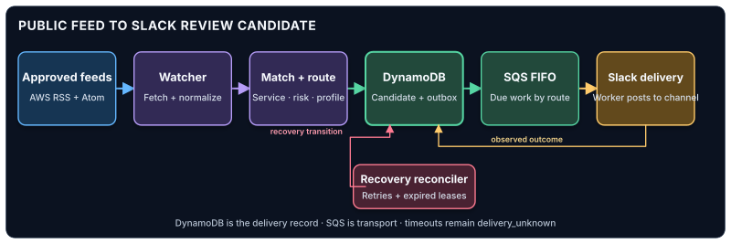
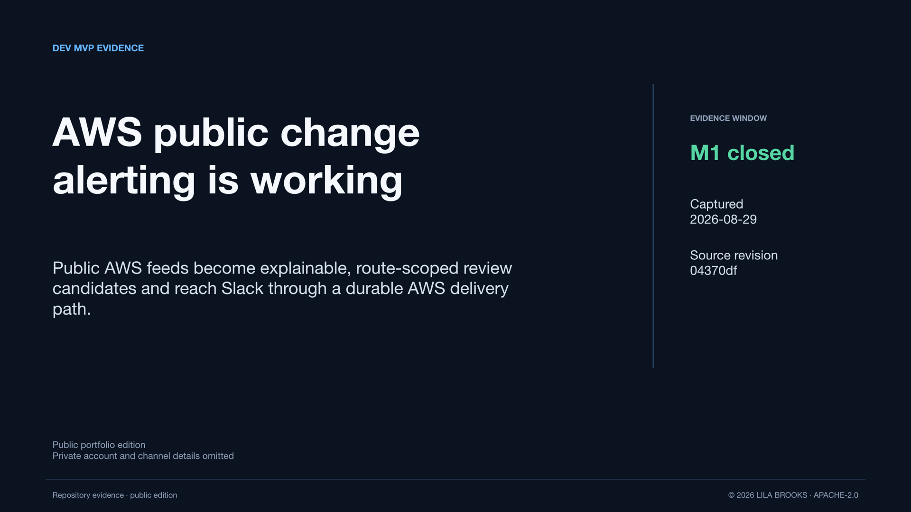

# AWS Public Change Alerting

[](https://github.com/lilabrooks/aws-public-change-feed/actions/workflows/quality.yml)
[](https://github.com/lilabrooks/aws-public-change-feed/actions/workflows/security.yml)
[](https://lilabrooks.github.io/aws-public-change-feed/)
[](LICENSE)

AWS Public Change Alerting reads approved AWS RSS and Atom feeds. It matches announcement titles and summaries against configured service aliases and risk phrases, maps each match to static environment profiles, and sends a route-specific review candidate to Slack.

Each candidate includes the matched text, service, risk type, mapped environments, Slack destination, announcement revision, and configuration release. Public feed matches are **potentially relevant**. Operators confirm account or resource impact with their existing AWS tools.

[](https://lilabrooks.github.io/aws-public-change-feed/)

[Open the full system diagram and generated Slack message.](https://lilabrooks.github.io/aws-public-change-feed/)

## Project status

GitHub Issues and milestones hold the current backlog state.

| Milestone | State | Purpose |
| --- | --- | --- |
| [D0: first live Slack delivery](https://github.com/lilabrooks/aws-public-change-feed/milestone/1) | Closed | Send one real public AWS announcement through the deployed dev service and record the Slack result. |
| [M1: dev MVP](https://github.com/lilabrooks/aws-public-change-feed/milestone/2) | Closed | Run the dev service on schedule and exercise delivery, recovery, the fixed load case, and alarm notification. |
| [M2: lifecycle and replay](https://github.com/lilabrooks/aws-public-change-feed/milestone/3) | Closed | Set expiry and retirement rules for feed state and releases, add saved-response replay, and fix named recovery failures. |
| [M3: production-readiness proof](https://github.com/lilabrooks/aws-public-change-feed/milestone/4) | Open | Choose production policy and recovery targets, prove rollback, then run the production-readiness gate. |

### D0: first live Slack delivery

D0 sent one real public AWS announcement through the deployed dev service to Slack.

- The first active dev configuration release was published and loaded with the exact application package.
- The watcher created a candidate and delivery record. The dispatcher sent the request through SQS FIFO, the worker posted it, and DynamoDB recorded `posted`.
- One request was sent while the other 11 stayed durably queued for M1. The owner confirmed the complete message in Slack.
- A missing active manifest was separated from a denied read, and one Lambda security false positive caused by use-case prose was removed before the live run.

### M1: dev MVP

M1 ran the whole dev service on schedule and exercised delivery, recovery, load, and alarms.

- All 4 runtime triggers were enabled in dev. The 12-message public-feed cohort reached Slack with 1 network attempt and an HTTP 200 response per post, and DynamoDB recorded `posted` for all 12.
- The recovery exercise moved one `pending_queue` record to `posted` with 1 Slack attempt and one expired `sending` record to `delivery_unknown` with 0 Slack attempts.
- The fixed load run created 5 records per minute for 10 minutes and stopped at 50 records.
- The owner confirmed receipt of the alarm email.
- Pull requests and weekly CI scan all 3 pinned Python dependency manifests and tracked plaintext for high and critical findings. Terraform scans run separately for the bootstrap, central, and preflight entry points. Classified findings remain visible, and any change from their exact reviewed baseline fails the job.

### M2: lifecycle and replay

M2 set rules for old feed data, removed feeds, saved responses, and known recovery failures.

- The post-MVP policy review kept the current 4 feeds, matching rules, message limits, and retention periods.
- Announcement history now expires 730 days after its latest observation. Response-page completion records get the same 730-day window. Active feed checkpoints stay until a reviewed feed-retirement operation.
- On 2026-08-30, the one-time migration added retention dates to 76 announcement rows and 88 response-page rows. It left the 4 active feed checkpoints alone and removed the temporary table-scan role after verification.
- [L-48](https://github.com/lilabrooks/aws-public-change-feed/issues/159) adds exact-feed preview/apply plans for retirement, post-retention tombstone compaction, and reviewed same-URL restoration. The permanent operator role can read and conditionally update only the session-tagged feed key. Repository tests simulate the 730-day boundary; no live feed has been retired or restored.
- [L-14](https://github.com/lilabrooks/aws-public-change-feed/issues/92) adds reviewed deletion of old configuration and inventory releases. It preserves the active release, at least the newest 10, and every release still needed for delivery review, replay, investigation, or rollback. Eligible releases are at least 400 days old, and deletion accepts only an unchanged reviewed plan. The command has local simulated coverage; no live release retirement has run.
- [L-35](https://github.com/lilabrooks/aws-public-change-feed/issues/122) adds a preview-first command that replays one exact retained feed response through the runtime parser, normalizer, matcher, and candidate builder during the 30-day raw-snapshot window. Its saved plan binds the response digest, retained pointer version, durable-state fingerprint, operator, purpose, and expected routes. Apply fills missing state, suppresses existing candidates, and has no permission to read or write feed checkpoints.
- State and package cleanup removed the unused `dynamodb:TransactWriteItems` IAM action, tests that `__pycache__` directories and loose `.pyc` files stay out of Lambda packages, and requires every combined source-state read to name either a feed or announcement record explicitly.
- The deployment runbook now changes the infrastructure host allowlist and configuration feed-host set in one paused sequence. It reads back all 4 trigger states, records the alarm exposure that survives the pause, and restores the recorded states after the release and deployed host sets agree.
- Terraform-output capture now stops on command, shape, or move failure; refuses to overwrite either capture path; and preserves a failed temporary as evidence until an owner-reviewed move releases the path for a new capture ID.
- Watcher failures now receive one terminal classification: a bounded stop emits `IncompleteRuns`, while a later unexpected fault replaces that provisional marker with `WatcherFaults`. The post-MVP recovery review retained `delivery_unknown` for expired Slack send leases. The controlled exercise proved the transition without another call, while the byte-send outcome of a natural timeout remains unknown.

### M3: production-readiness proof

M3 decides whether the current service and deployment are ready for production.

- [L-40](https://github.com/lilabrooks/aws-public-change-feed/issues/145) selected the current 4-feed, 3-service, 4-risk-rule policy unchanged for production preflight. Its [evidence record](docs/evidence/production-policy.md) retains all 12 service and risk-type pairs, including 6 with no historical positive, and keeps the global thresholds without inventing pair-specific floors.
- [L-41](https://github.com/lilabrooks/aws-public-change-feed/issues/146) now has accepted recovery decisions in ADR-027 and ADR-028: both DynamoDB tables use a 35-day PITR window, a 5-minute recovery-point target, and a 4-hour operator recovery-time target, while a separate CloudTrail-only role supplies digest-bound restore identity evidence. The first live restore created both targets but remained incomplete when DynamoDB omitted `RestoreSummary` after they became active. No cutover or restored-table runtime write occurred, and the original bindings and triggers were restored. A fresh restore, cutover, rollback, trigger-restoration proof, and cleanup remain open.
- [L-42](https://github.com/lilabrooks/aws-public-change-feed/issues/147) now has a source-defined, direct-invocation shadow evaluator with no durable-state authority, a scoped invoker, fixed refusal codes, and an exact preview/apply command for configuration rollback and forward restoration. Proposed ADR-026 requires all durable runtimes to stop before rollback and records the five-function application boundary. The live shadow run, both configuration promotions, application rollback and restoration, and historical-reference proof have not run yet.
- [L-43](https://github.com/lilabrooks/aws-public-change-feed/issues/148) will map every M2 change to the M1 evidence it could affect. It will reuse evidence only for unchanged mechanisms, rerun affected or missing checks, and record the result as passed, failed, or incomplete.
- [L-44](https://github.com/lilabrooks/aws-public-change-feed/issues/149) will update the goal, architecture status, README, and public site after the production gate so every completion claim matches the recorded result.

See the [open issues](https://github.com/lilabrooks/aws-public-change-feed/issues) for the current work queue. The [goal](docs/GOAL.md) defines product scope and completion criteria; its long-form status will be reconciled after the production gate.

## MVP walkthrough

[](https://lilabrooks.github.io/aws-public-change-feed/)

The public walkthrough traces the Terraform roots, Lambda runtimes, matcher corpus, candidate fields, DynamoDB state, SQS FIFO delivery, and recorded Slack responses. Private account and channel details are omitted.

[Watch with captions](https://lilabrooks.github.io/aws-public-change-feed/) · [Open the slide deck as PDF](site/media/mvp-evidence-v2/aws-public-change-alerting-mvp-evidence-v2.pdf) · [Download the editable PowerPoint](site/media/mvp-evidence-v2/aws-public-change-alerting-mvp-evidence-v2.pptx) · [Read the transcript and recorded results](docs/evidence/mvp-walkthrough.md)

## Processing path

1. The watcher fetches configured public hosts with TLS, DNS and IP checks, redirect refusal, byte limits, and parser limits.
2. Feed items are normalized and duplicate URLs are merged across sources.
3. Service aliases and risk phrases are matched against each title and summary.
4. Static profiles map matches to environments and Slack routes.
5. DynamoDB stores the candidate and delivery request before the feed checkpoint advances.
6. The dispatcher sends due work through SQS FIFO. The worker posts to Slack and writes the observed outcome back to DynamoDB.
7. The reconciler retries eligible work and converts expired sending leases to `delivery_unknown`.

## Why DynamoDB and SQS both exist

Four failure cases explain the delivery table:

- **The watcher stops before queueing the alert.** It saves the candidate and a `pending_queue` record before moving the feed checkpoint. The dispatcher finds that saved record and sends it to SQS. If the save never finished, the old checkpoint makes the next watcher run rebuild the same candidate.
- **The same SQS message arrives again.** The worker checks DynamoDB before calling Slack. A `posted` record means the message has already completed, so the worker acknowledges the queue message without posting twice. This check still works after SQS FIFO's 5-minute send-deduplication window has passed.
- **Slack asks the service to retry later.** The worker records the next allowed attempt time in `next_action_at` and acknowledges the current queue message. The dispatcher sends a new queue message when that time arrives. The Lambda does not sleep while it waits.
- **Slack may have posted the message, but the worker lost the response.** A timeout or stopped Lambda can leave the record in `sending`. When its lease expires, the reconciler changes it to `delivery_unknown`. Automatic delivery stops until an operator checks Slack and records what happened.

A direct SQS-to-Lambda-to-Slack path is a smaller design for notifications that can tolerate repeated posts and limited outcome history. This project requires missed, delayed, duplicate, and ambiguous work to remain visible. [ADR-004](docs/adr/004-explicit-slack-delivery-guarantees.md) defines the Slack outcome rules, and [ADR-007](docs/adr/007-central-slack-delivery-queue-and-worker.md) defines the outbox and queue boundary. The service does not claim exactly-once Slack delivery.

## Required runtime rules

| Rule | Effect |
| --- | --- |
| Public inputs only | The runtime has no customer-account credentials, resource discovery, telemetry, or remediation access. |
| Stable IDs | The same announcement revision, service, risk, route, audience, and release produce the same candidate ID. |
| Immutable releases | Every candidate points to exact configuration, inventory, and application versions. |
| DynamoDB owns delivery state | SQS FIFO carries ready work; it does not replace the durable outbox or outcome history. |
| Slack uncertainty stays visible | A timeout becomes `delivery_unknown`. An operator checks Slack before closure or one audited retry. |
| Credentials stay with the worker | Feed content, configuration, candidates, fixtures, and logs contain no Slack secret values. |

The [numbered specification and 23 accepted ADRs](docs/architecture/README.md) define these rules in full.

## Run locally

Python 3.12 or newer is required.

```bash
python3.12 -m venv .venv
. .venv/bin/activate
make install
make check
```

`make check` runs formatting, Python and YAML lint, type checks, schema and cross-file validation, corpus scoring, the full unit-test suite, and whitespace checks. It validates the Terraform roots when Terraform is installed and runs TFLint with its AWS ruleset when TFLint is installed. CI requires both tools, tests Terraform 1.15.8 and the minimum supported 1.10.0 release, and checks every pull request's committed diff for Git whitespace errors.

Useful focused commands:

| Command | Result |
| --- | --- |
| `make validate` | Validates contracts, local references, the public page, and corpus thresholds. |
| `make evaluate-corpus` | Scores matching with the reviewed [`config/dev.yaml`](config/dev.yaml) policy. |
| `make screen-feeds` | Fetches the configured public feeds through the runtime acquisition path and reports current matches. |
| `make references-online` | Checks external links with Lychee. |
| `make terraform-clean` | Removes the root `.terraform` working directories under `infra/bootstrap`, `infra/central`, and `infra/preflight`. |

The corpus evaluator and feed screener accept `--root` and `--config`. Relative paths resolve from `--root`; absolute paths are accepted. The Make targets select [`config/dev.yaml`](config/dev.yaml) explicitly.

`make screen-feeds` and `make references-online` use the network. Feed screening reads public sources and does not require AWS credentials. Online reference checks require the `lychee` executable.

Terraform cleanup is event-driven. Use `make terraform-clean` after a backend or account change, when stale initialization causes failures, or to reclaim local disk. The target preserves every `.terraform.lock.hcl`, local and remote state, Terraform configuration, and other files. Rerun `terraform init` in each affected root with the intended backend settings before planning or applying.

## Repository map

| Path | Contents |
| --- | --- |
| [`src/aws_public_change_feed/`](src/aws_public_change_feed/) | Feed acquisition, matching, candidates, releases, delivery, and recovery. |
| [`infra/`](infra/) | Terraform roots for bootstrap, persistent service resources, and isolated live exercises. |
| [`schemas/`](schemas/) and [`examples/`](examples/) | 8 strict JSON Schemas and one cross-file contract bundle. |
| [`config/`](config/) | Reviewed environment and matching policy. |
| [`corpus/`](corpus/) | Labeled announcements and accepted precision and recall thresholds. |
| [`site/`](site/) | GitHub Pages source, public MVP media, editable draw.io diagram, SVG export, and generated Slack example. |
| [`scripts/`](scripts/) and [`tests/`](tests/) | Validators, operator commands, regression tests, and service-mock tests. |
| [`docs/`](docs/) | Product goal, specification, ADRs, runbooks, agent-tooling notes, and supporting assets. |

## Documentation

- [Public system page](https://lilabrooks.github.io/aws-public-change-feed/): system diagram, processing summary, contract checks, and generated Slack output.
- [Product goal](docs/GOAL.md): scope, exclusions, quality bar, and completion criteria.
- [Architecture index](docs/architecture/README.md): 6 specification chapters, 23 accepted ADRs, and the schema-to-example map.
- [Operations runbook](docs/runbooks/operations.md): deployment, alarms, recovery, replay, rollback, and incident procedures.
- [Agent tooling notes](docs/agent-tooling.md): repository-specific AWS documentation and research boundaries.
- [Dev MVP walkthrough](docs/evidence/mvp-walkthrough.md): narrated video, slides, captions, transcript, recorded results, and artifact hashes.
- [Production policy evidence](docs/evidence/production-policy.md): exact policy inputs, corpus results, pair-level sample limits, and revisit conditions.

Changes to product scope, trust boundaries, identity, state ownership, delivery guarantees, or version policy require an ADR. Run `make check` before opening a pull request.

## License

Copyright 2026 Lila Brooks.

Licensed under the [Apache License 2.0](LICENSE). Redistributed copies and derivative works must preserve the attribution in [NOTICE](NOTICE).

References verified: 2026-08-29.
