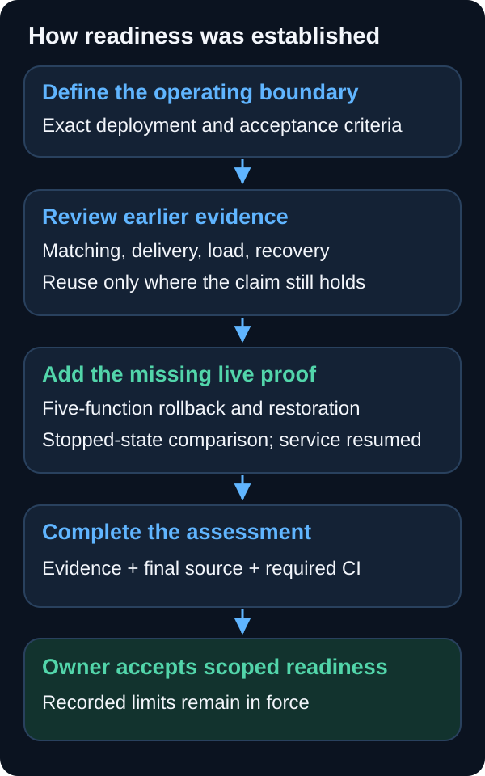

# How production readiness was established

M3 closed on 2026-09-07 after the repository owner accepted the evidence for
the reviewed persistent-dev deployment: one environment, one AWS account,
one Slack destination, four public feeds, three services, four risk rules,
and a 300-delivery/hour arrival envelope. This is the explanation used by the
public site and the readiness chapters of the service walkthrough.

The [readiness assessment](evidence/m3-production-readiness-assessment-2026-09-06.md)
owns the criterion-by-criterion decision. The records below retain the exact
identities, measurements, and limits behind it.

## Start with a defined claim

The MVP had already demonstrated the path from a public announcement to a
recorded Slack delivery. Production readiness added a question: did the exact
reviewed deployment have enough evidence for its matching, delivery, recovery,
rollback, and operating requirements?

The scope stayed fixed throughout the decision. Public announcements indicate
potential relevance to configured environments; they do not prove customer
impact. Repository-supported scale ceilings were outside the assessment.

## Reuse evidence when the claim still holds

Earlier exercises supplied matching measurements, confirmed Slack and alarm
receipt, a fixed 50-message capacity cohort, configuration rollback, and a
bounded database recovery proof. Each reuse decision examined changes since
that evidence's own baseline, including runtime, dependencies, permissions,
policy, and deployment composition.

A relevant change could require a targeted check. Unrelated changes did not
automatically require another live exercise. This kept the remaining work
focused on unanswered questions. A quiet feed sample stayed valid evidence;
the observation was never extended merely to find a positive announcement.

## Prove the missing application transition

L-42 had proved configuration rollback but ended `incomplete` because
application rollback had not run. Package qualification and a genuine
successor made that remaining proof possible.

In L-54, the service drained accepted work and paused all four durable
executors. Five Lambda functions moved to the exact qualified predecessor,
passed a bounded shadow check, then returned to the exact successor and passed
another. Both checks processed four feeds and 240 items and returned the same
eight candidate identities. Configuration stayed fixed and replay stayed
preview-only.

The stopped-state comparison matched both DynamoDB table digests, the complete
raw-snapshot version inventory, queues, pointer, restored packages, and paused
controls. The records contain counts and digests rather than complete row
snapshots. The no-post conclusion also relies on the paused delivery path and
the shadow evaluator's in-memory composition and restricted permissions.

## Restore service, then make the decision

One reviewed plan restored the original controls and alarms. A fixed natural
scheduled window showed healthy producers; all 28 alarms reached `OK`, and
Terraform reported no changes. The final source candidate passed required CI
before the owner accepted the readiness assessment.

The passing result retains its limits. Six configured service/risk pairs had
no historical positive. Slack delivery can remain ambiguous. Database recovery
proved stopped restored-table binding and restart on primaries, not live
service on restored data. Another deployment or a larger workload needs its
own assessment of the affected claims.

## Follow the evidence

| Question | Record |
| --- | --- |
| What scope and matching policy were accepted? | [Production policy](evidence/production-policy.md) and [ADR-018](adr/018-corpus-evaluation-and-matching-thresholds.md) |
| Where are the earlier delivery and load results? | [M1 live cohort](https://github.com/lilabrooks/aws-public-change-feed/issues/137) (comment `5445268720`) and [MVP walkthrough](evidence/mvp-walkthrough.md) |
| What did database recovery establish? | [L-41 live evidence](https://github.com/lilabrooks/aws-public-change-feed/issues/146) (comment `5554120649`) and [ADR-027's accepted boundary](adr/027-dynamodb-point-in-time-recovery.md) |
| Why could configuration evidence be reused? | [L-42 record](evidence/l42-shadow-and-rollback-2026-09-06.md) and [ADR-026](adr/026-central-shadow-and-rollback-proof.md) |
| What closed the application-proof gap? | [L-54 rollback and restoration](evidence/l54-application-rollback-2026-09-07.md) |
| What connects the evidence to the final source and decision? | [Readiness assessment](evidence/m3-production-readiness-assessment-2026-09-06.md), [PR #196](https://github.com/lilabrooks/aws-public-change-feed/pull/196), [owner decision](https://github.com/lilabrooks/aws-public-change-feed/issues/148) (comment `5563802837`), and [PR #197](https://github.com/lilabrooks/aws-public-change-feed/pull/197) |

The L-54 public record identifies its restricted bundle by manifest SHA-256.
The bundle was verified during this content update: all 69 listed files
matched. Raw operational evidence stays outside Git; an authorized reviewer
can request it from the repository owner and verify it against that manifest.

## Video narration

The [current walkthrough transcript](evidence/mvp-walkthrough.md#narration-transcript)
covers the completed M1, M2, and M3 milestones. Chapters 7–8 summarize the
application rollback proof and the scoped readiness result. Slides 2 and 3 explain the runtime architecture and service
choices. The video uses the same Kokoro-82M `af_heart` voice and
speed 1.0 throughout.

References verified: 2026-09-06.
