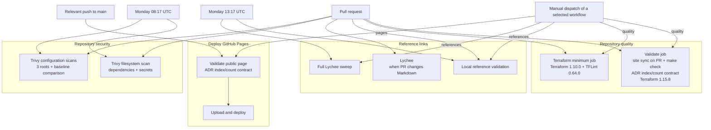

# Repository checks

This is the inventory of recurring local and CI checks in the repository. It covers every check target in the [Makefile](../Makefile), the 4 workflows under [`.github/workflows/`](../.github/workflows/), security scans, and the live checks kept outside the normal gate.

Run the local umbrella check with:

```bash
make check
```

That expands to Python format and lint checks, YAML lint, type checking, contract and reference validation, site validation, corpus evaluation, the unit suite, Terraform format and validation, TFLint, and Git whitespace checks.

## Make target map

| Target | Included in `make check` | Purpose |
| --- | --- | --- |
| `make check` | It is the umbrella target | Run every nonmutating local repository check listed as included below. |
| `make format-check` | Yes | Check Python formatting with Ruff. |
| `make lint` | Yes | Run both Python and YAML lint targets. |
| `make lint-python` | Yes, through `make lint` | Run Ruff's Python lint rules. |
| `make lint-yaml` | Yes, through `make lint` | Run yamllint over the configured YAML paths. |
| `make typecheck` | Yes | Run mypy over `scripts`, `tests`, and `src`. |
| `make validate` | Yes | Run configuration, reference, site, and corpus validation. |
| `make validate-config` | Yes, through `make validate` | Validate schemas, the canonical contract bundle, and the central deployment input. |
| `make validate-references` | Yes, through `make validate` | Check local Markdown links, anchors, reference dates, and Lychee policy files. |
| `make validate-site` | Yes, through `make validate` | Check the public HTML page, generated sample, diagram, media, README coupling, and ADR index/count contract. |
| `make evaluate-corpus` | Yes, through `make validate` | Score the matcher and enforce the approved corpus thresholds. |
| `make test` | Yes | Run the full `unittest` suite. |
| `make terraform-check` | Yes | Run Terraform formatting, backend-disabled initialization, and validation in all 3 roots. |
| `make tflint-check` | Yes | Run TFLint and its AWS plugin in all 3 roots. Local absence skips unless required mode is set. |
| `make whitespace` | Yes | Run Git's whitespace-error check on the working tree and, in CI, the pull-request commit range. |
| `make references-online` | No | Run local reference validation, then check external links with Lychee. |
| `make screen-feeds` | No | Fetch the reviewed public feeds through the runtime acquisition path and report current rule matches. |

`make format`, `make generate-slack-sample`, `make clean`, and `make terraform-clean` change files or remove generated caches, so they are maintenance targets rather than checks.

## Python

| Check | Files | What it rejects |
| --- | --- | --- |
| `make format-check` | `scripts/`, `tests/`, and `src/` | Python that differs from Ruff's formatter at the repository's 120-character line length and Python 3.12 target. |
| `make lint-python` | The same paths | Ruff findings from `B`, `E4`, `E7`, `E9`, `F`, `I`, and `UP`: bugbear checks, selected pycodestyle errors, syntax/runtime errors, Pyflakes, import ordering, and Python-upgrade rules. |
| `make typecheck` | The same paths | Mypy errors under [`pyproject.toml`](../pyproject.toml). Runtime modules under `aws_public_change_feed.*` carry the stricter per-module settings. |
| `make test` | [`tests/`](../tests/) | Unit, contract, service-mock, state-machine, renderer, parser, security-boundary, workflow, and Terraform contract failures. The real-S3 concurrency classes skip unless their bucket variable is supplied. |
| `make validate-config` | The validator and files it loads | Python older than 3.12, plus the contract failures described below. |

CI installs the exact versions in [`requirements-dev.txt`](../requirements-dev.txt) and runs with Python 3.12. Local `make check` uses `python3` unless `PYTHON` is overridden.

## Shell and command snippets

Executable shell code lives in Make recipes and GitHub Actions `run` blocks. The tracked tree contains 0 standalone `.sh`, `.bash`, `.zsh`, or `.fish` files.

Make and CI execute those snippets as part of the targets and jobs that contain them. [`tests/test_makefile.py`](../tests/test_makefile.py) exercises the whitespace and cleanup recipes, while workflow tests inspect action pins, triggers, permissions, and exact command wiring.

ShellCheck, shfmt, `bash -n`, and actionlint are absent. YAML lint treats workflow block scalars as YAML strings, so it does not validate their shell syntax.

## YAML

| Check | Files | What it rejects |
| --- | --- | --- |
| `make lint-yaml` | [`.yamllint.yaml`](../.yamllint.yaml), [`examples/`](../examples/), [`.github/dependabot.yml`](../.github/dependabot.yml), and [`.github/workflows/`](../.github/workflows/) | YAML syntax and the configured yamllint rules: 120-character lines, except non-breakable inline mappings, plus lowercase `true` and `false`. A document-start marker is optional. |
| `make validate-config` | [`examples/deployment.yaml`](../examples/deployment.yaml), [`examples/config.yaml`](../examples/config.yaml), and [`infra/central/deployment.yaml`](../infra/central/deployment.yaml) | Duplicate mapping keys, malformed YAML, JSON Schema violations, unknown fields, unsupported formats or versions, and the cross-document rules listed in the JSON section below. |
| `make evaluate-corpus` | [`config/dev.yaml`](../config/dev.yaml) | A policy that cannot load services and risk rules or cannot meet the corpus thresholds. The command uses this file as matcher input; it is not a schema-validation pass over the policy. |
| `make terraform-check` | [`infra/central/deployment.yaml`](../infra/central/deployment.yaml) and [`infra/preflight/deployment.yaml`](../infra/preflight/deployment.yaml), through Terraform `yamldecode` calls | YAML that Terraform cannot decode and values rejected by the Terraform root's variable checks, preconditions, or checks. |
| `make test` | Workflow, scanner, baseline, deployment, and policy YAML used by targeted tests | GitHub Action references without a full 40-character commit SHA and readable version comment, inconsistent action pins, changed workflow permissions or triggers, changed Trivy policy or baseline accounting, and repository-specific deployment or policy drift covered by the tests. |

The direct yamllint target's complete path list is [`.yamllint.yaml`](../.yamllint.yaml), [`examples/`](../examples/), [`.github/dependabot.yml`](../.github/dependabot.yml), and [`.github/workflows/`](../.github/workflows/). [`config/dev.yaml`](../config/dev.yaml), both infrastructure deployment files, [`trivy.yaml`](../trivy.yaml), and [`.github/trivy-terraform-baseline.yml`](../.github/trivy-terraform-baseline.yml) receive the targeted checks named above.

## Terraform

The 3 Terraform roots are [`infra/bootstrap`](../infra/bootstrap/), [`infra/central`](../infra/central/), and [`infra/preflight`](../infra/preflight/).

| Check | What runs | What it rejects |
| --- | --- | --- |
| `make terraform-check` | `terraform fmt -check`, `terraform init -backend=false -input=false -lockfile=readonly`, and `terraform validate` in each root | Noncanonical HCL formatting, initialization failures, provider-lock drift, invalid syntax, bad references, type errors, and failed static validation rules. Backend access is disabled. |
| `make tflint-check` | `tflint --init` once, then TFLint in each root with [`.tflint.hcl`](../.tflint.hcl) | Core TFLint findings and AWS ruleset findings. Module calls are included, and the AWS plugin version is pinned in the TFLint configuration. |
| `make test` | [`tests/test_terraform_contracts.py`](../tests/test_terraform_contracts.py) and related contract tests | Cross-file rules that `terraform validate` cannot prove, including backend and lockfile boundaries, IAM resource/action coupling, trigger gates, alarm-to-runtime contracts, runbook coverage, package identity, preflight isolation, recovery settings, and allowed invalid-input failures. |
| Repository security workflow | Trivy configuration scans of each root, followed by [`scripts/compare_trivy_baseline.py`](../scripts/compare_trivy_baseline.py) against [`.github/trivy-terraform-baseline.yml`](../.github/trivy-terraform-baseline.yml) | Scanner failures and any unreviewed change in finding count, rule, severity, source path, or scan-root context. The baseline classifies findings and does not suppress them. |

Local `terraform-check` and `tflint-check` print a skip and succeed when their binaries are missing. Set `REQUIRE_TERRAFORM=1` or `REQUIRE_TFLINT=1` to turn absence into a failure. CI requires both tools in its Terraform 1.10.0 job; the main quality job also runs `make check` with Terraform 1.15.8 required.

Trivy is a CI check in [`.github/workflows/security.yml`](../.github/workflows/security.yml). It is not part of `make check`.

## JSON

| Check | Files | What it rejects |
| --- | --- | --- |
| `make validate-config` | The 6 configuration and event schemas paired with the fixtures in [`examples/`](../examples/) | Duplicate object keys in loaded contract JSON and schemas, invalid draft 2020-12 schemas, instance/schema mismatches, format failures, and unknown fields in owned objects. |
| `make validate-config` semantic pass | The 6-file example bundle: deployment, configuration, inventory, active manifest, candidate, and delivery request | Broken references or projections, release keys and hashes, schema-version claims, deterministic IDs, route and destination mapping, feed and webhook hosts, service/profile/environment coverage, risk-term conflicts, retention and capacity bounds, message rendering limits, creation-time ordering, and JSON byte limits. |
| `make evaluate-corpus` | [`corpus/announcements.json`](../corpus/announcements.json) and [`corpus/thresholds.json`](../corpus/thresholds.json) | Schema violations, duplicate corpus item IDs, a corpus above 2 MiB, and measured precision or recall below the approved global or pair-specific thresholds. |
| `make test` | Contract fixtures, packaged schema copies, MCP and host settings, Terraform-output fixtures, and JSON used by focused tests | Mutation cases for rejected contracts, stale or mismatched identity vectors, packaged schema drift from [`schemas/`](../schemas/), host-configuration mismatch, and the repository-specific JSON invariants asserted by each test module. |

JSON coverage is file-specific. The contract and corpus commands cover the paths above; focused tests or commands load the other JSON files they own.

## Markdown

| Check | Files | What it rejects |
| --- | --- | --- |
| `make validate-references` | Every `*.md` under the repository, excluding Git, virtual environments, tool caches, build output, and `node_modules` | Missing local targets, links that escape the repository, missing Markdown anchors, fragments on non-Markdown files, malformed or future reference dates, and external URLs in a file without a `References verified: YYYY-MM-DD` marker. Reference age warns after 180 days and fails after 365 days. |
| `make validate-references` policy pass | [`lychee.toml`](../lychee.toml) and [`.lycheeignore`](../.lycheeignore) | Missing, malformed, changed, or extra Lychee policy settings; exclusions without a reason and expiry; and expired exclusions. |
| `make references-online` | Markdown links selected by [`lychee.toml`](../lychee.toml) | The local reference failures above, followed by unreachable external HTTP or HTTPS references under the configured retry, redirect, timeout, fragment, and HTTPS policy. This command needs the network and a `lychee` executable. |
| `make validate-site` | [`README.md`](../README.md), [`docs/adr/`](adr/), [`docs/architecture/README.md`](architecture/README.md), plus the public page and its assets | Removal of the public-page link from the README, a Mermaid block in the README, drift in the public page's structure, assets, diagram, generated Slack sample, or evidence files, and a broken ADR status, index, or public-count contract. Every ADR must have one top-level status and one architecture-index entry; accepted-ADR counts in the README and site must equal the count derived from ADR statuses. |
| Pull-request site-sync check | [`docs/GOAL.md`](GOAL.md), [`docs/architecture/`](architecture/), [`docs/adr/`](adr/), [`schemas/`](../schemas/), [`examples/`](../examples/), and `site/` | A change to public narrative or contract inputs without a matching change to `site/index.html`. This diff-aware form runs in the quality workflow. |
| `make test` | README, architecture, ADR, runbook, and workflow documentation named by focused tests | Drift in documented commands, architecture indexes, runbook-to-Terraform mappings, acceptance wording, and other repository contracts encoded in tests. |

`make check` runs the local reference validator and site validator. External link requests stay in `make references-online`; CI runs them on pull requests that change Markdown and in the scheduled or manually dispatched reference workflow.

Markdown style linting such as markdownlint is currently absent.

## Public site, diagrams, and media

`make validate-site` checks more than HTML. [`scripts/validate_site.py`](../scripts/validate_site.py) requires the public page and its assets, parses page structure and local references, verifies required section IDs and accessibility fields, and forbids Mermaid in the page and README.

It also checks:

- one top-level status per ADR, one architecture-index entry per ADR, and README/site accepted-ADR counts derived from those statuses;
- the required draw.io nodes, edges, and AWS icon identifiers;
- the SVG's exact draw.io source hash, root element, title, description, image role, and accessible label reference;
- the generated Slack sample against the canonical candidate and renderer;
- the WebVTT header and timestamp syntax;
- PNG, PDF, ISO media, and PowerPoint container signatures;
- every evidence filename and SHA-256 entry;
- required SPDX notices in the site's CSS and JavaScript.

The Pages workflow runs this validator again before upload and deployment. Dedicated HTML, CSS, JavaScript, SVG, and media linters are absent.

## Security checks

Security CI is defined in [`.github/workflows/security.yml`](../.github/workflows/security.yml). It runs on pull requests and every Monday at 08:17 UTC.

| Check | Scope | Failure rule |
| --- | --- | --- |
| Trivy dependency scan | [`requirements.txt`](../requirements.txt), [`requirements-dev.txt`](../requirements-dev.txt), and [`requirements-lambda.txt`](../requirements-lambda.txt) | A HIGH or CRITICAL vulnerability fails the job. [`trivy.yaml`](../trivy.yaml) adds both `requirements-*.txt` manifests to Trivy's standard pip-manifest discovery. |
| Trivy secret scan | The checked-out repository tree | A HIGH or CRITICAL secret finding fails the job. |
| Trivy Terraform scan | Each Terraform root as a separate scan, at LOW through CRITICAL severity | Each scan produces JSON without failing on findings. [`scripts/compare_trivy_baseline.py`](../scripts/compare_trivy_baseline.py) then fails on scanner errors or any unreviewed change in scanner version, count, rule, severity, path, or root context. |
| Security workflow contract tests | The workflow, [`trivy.yaml`](../trivy.yaml), and the reviewed Terraform finding baseline | Changed triggers, permissions, action pins, Trivy version or arguments, manifest coverage, baseline totals, classification accounting, or required limitation text fail `make test`. |
| GitHub Action pin tests | Every `uses:` entry in every workflow | Tags, shortened SHAs, missing readable version comments, and inconsistent commits for the same action fail `make test`. |
| Agent boundary tests | [`.mcp.json`](../.mcp.json), [`.codex/config.toml`](../.codex/config.toml), [`.claude/settings.json`](../.claude/settings.json), [`AGENTS.md`](../AGENTS.md), and [`CLAUDE.md`](../CLAUDE.md) | Host configuration mismatch, non-HTTPS MCP endpoints, missing account-capable-tool denials, stale deny-server names, broken imports, or duplicated shared instructions fail `make test`. |
| Runtime security tests | Acquisition, URL, TLS, parsing, credentials, Slack transport, release, storage, delivery, and Terraform modules | Unsafe hosts or addresses, redirects, entity expansion, unbounded inputs, credential-kind errors, secret leakage, ambiguous network outcomes, bad IAM coupling, route crossing, and other acceptance failures covered by the named test modules fail `make test`. |

[`tests/test_acquisition.py`](../tests/test_acquisition.py), [`tests/test_pinned_https.py`](../tests/test_pinned_https.py), [`tests/test_aws_credentials.py`](../tests/test_aws_credentials.py), [`tests/test_slack_transport.py`](../tests/test_slack_transport.py), [`tests/test_worker.py`](../tests/test_worker.py), and [`tests/test_terraform_contracts.py`](../tests/test_terraform_contracts.py) carry most of the runtime security regression cases.

Dependabot checks pip and GitHub Actions dependencies monthly and proposes grouped updates. It is maintenance automation rather than a pass/fail check. [`SECURITY.md`](../SECURITY.md) is the reporting policy; the file does not define another scanner.

The repository does not configure Bandit, Semgrep, CodeQL, Checkov, tfsec, pip-audit, Safety, Gitleaks, detect-secrets, an SBOM generator, a license scanner, or a container-image scan.

## TOML, HCL, lock files, and plain text

- [`pyproject.toml`](../pyproject.toml) is consumed by Ruff, mypy, and package tooling. A malformed relevant section fails the tool that reads it.
- [`lychee.toml`](../lychee.toml) is parsed by the reference validator, which requires the exact reviewed key set and values.
- [`.codex/config.toml`](../.codex/config.toml) is parsed and compared with `.mcp.json` by the agent boundary tests.
- [`.tflint.hcl`](../.tflint.hcl) is consumed by TFLint, and its expected AWS ruleset version is covered by the Terraform CI setup and tests.
- Every Terraform root's [`.terraform.lock.hcl`](../infra/bootstrap/.terraform.lock.hcl) is held read-only during `terraform init`; a provider selection that needs a lock-file edit fails `terraform-check`.
- Requirements manifests use exact versions. Trivy scans all 3 for vulnerabilities, and the Lambda package tests exercise the production lock used by the deterministic builder.
- `git diff --check` catches whitespace errors in every tracked text format.

## Checks shared across file types

`make test` runs the full `unittest` suite, so many file checks above are reverse-contract tests: the test reads a source or documentation file and proves its relationship to another file.

`make whitespace` runs `git diff --check HEAD` against the working tree. When `CHECK_DIFF_BASE` is set, it also checks the committed `CHECK_DIFF_BASE...CHECK_DIFF_HEAD` range. This catches whitespace errors in YAML, Terraform, JSON, Markdown, and every other tracked text format. CI supplies the pull-request base and head SHAs.

The online and Trivy checks stay outside the local umbrella command:

```bash
make references-online
```

## CI workflow map

The 4 workflows fan out by trigger. Pull requests run quality, references, and security; scheduled jobs split security and external-reference checks across 2 Monday runs; a relevant push to `main` runs the Pages path.



GitHub receives separate results from these jobs. The tracked workflows contain 0 aggregate result jobs.

| Workflow | Trigger | Checks |
| --- | --- | --- |
| [Repository quality](../.github/workflows/quality.yml) | Pull request or manual dispatch | Python 3.12 setup, diff-aware public-page sync on pull requests, `make check` with the ADR index/count contract and Terraform 1.15.8 required, then a separate Terraform 1.10.0 and TFLint 0.64.0 job with both tools required. |
| [Reference links](../.github/workflows/reference-links.yml) | Pull request, weekly schedule, or manual dispatch | Local reference validation on every run; Lychee on Markdown-changing pull requests and on scheduled or manual sweeps. |
| [Repository security](../.github/workflows/security.yml) | Pull request or weekly schedule | Trivy dependency, secret, and root-scoped Terraform scans plus exact baseline comparison. |
| [Deploy GitHub Pages](../.github/workflows/pages.yml) | Relevant push to `main` or manual dispatch | Public-site and ADR index/count validation before Pages upload and deployment. |

All workflow `uses:` values are full commit SHAs with readable version comments, and `make test` enforces that contract.

## Live and operator-only validation

These checks need network access, AWS access, or an explicit operator decision. Their execution is operator-triggered:

| Check | Purpose |
| --- | --- |
| `make references-online` | Check external Markdown links with Lychee after local reference validation. |
| `make screen-feeds` | Fetch the configured feeds through production acquisition and report matches for vocabulary review. |
| `APCF_CONCURRENCY_BUCKET=... python -m unittest tests.test_s3_real_bucket` | Exercise S3 conditional writes and concurrent pointer promotion against the dedicated real bucket. These classes account for the environment-gated skips in the ordinary unit run. |
| [`scripts/preflight_delivery.py`](../scripts/preflight_delivery.py) | Bind and verify the disabled-trigger delivery preflight before a real watcher, queue, worker, and Slack exercise. |
| [`scripts/preflight_runtime_exercise.py`](../scripts/preflight_runtime_exercise.py) | Preview and run the isolated recovery or fixed-load exercise, then verify teardown boundaries. |
| [`scripts/prove_dynamodb_recovery.py`](../scripts/prove_dynamodb_recovery.py) | Preview and verify the paired DynamoDB point-in-time recovery procedure. |
| Publication, replay, redrive, migration, and retirement scripts under [`scripts/`](../scripts/) | Validate the exact identities, plans, state versions, hashes, and preview/apply preconditions each command owns. |

The [operations runbook](runbooks/operations.md) owns the exact live commands and evidence requirements, including IAM policy simulation, applied S3 lifecycle inspection, destination preflight, alarms, rollback, replay, recovery, and notification receipt.
